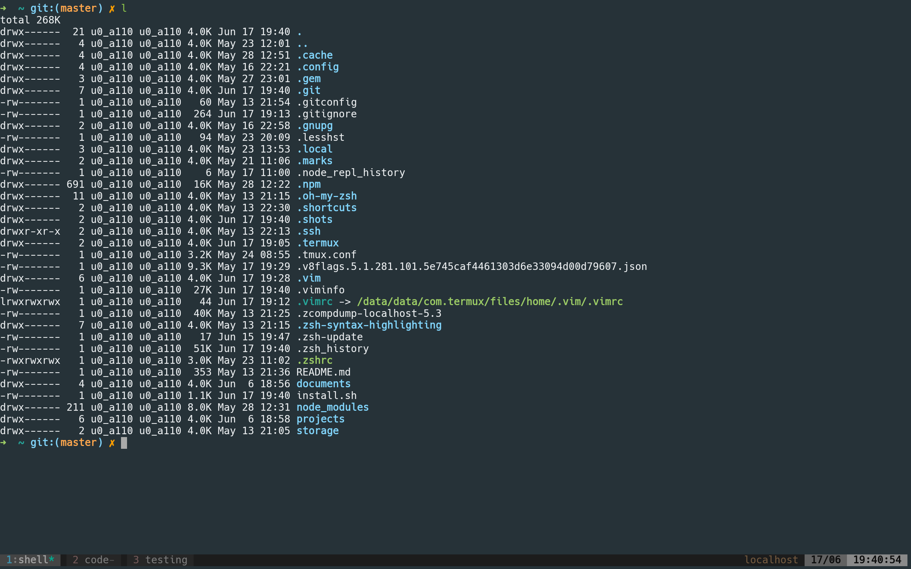

# awesomeTermux

> Install termux configuration

After installing this you will have:

+	some neat software installed
+	a neat terminal theme
+	zsh & oh-my-zsh
+	zsh syntax highlighting
+	vim + Colors + Powerline

## Look

## Requirements

+	curl

## Install

	$ sh -c "$(curl -fsSL https://raw.githubusercontent.com/chrootzius/awesomeTermux/master/install.sh)"
